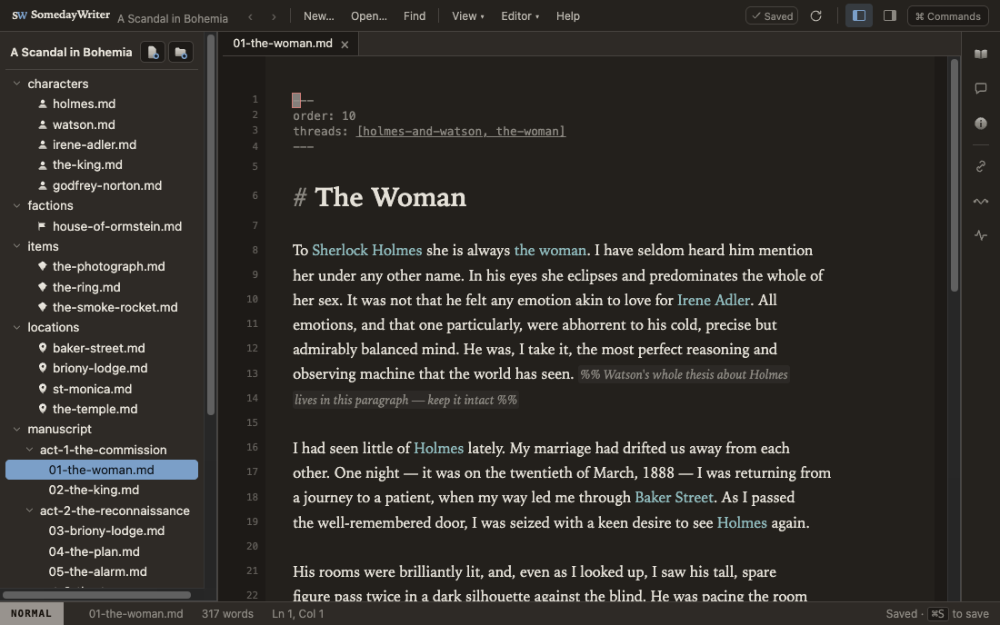
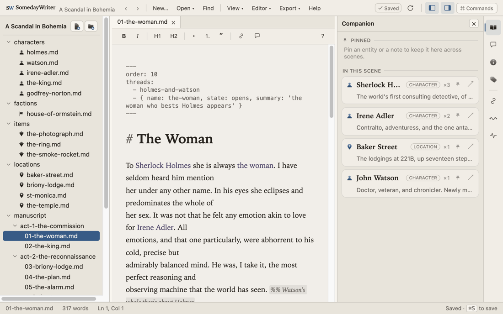
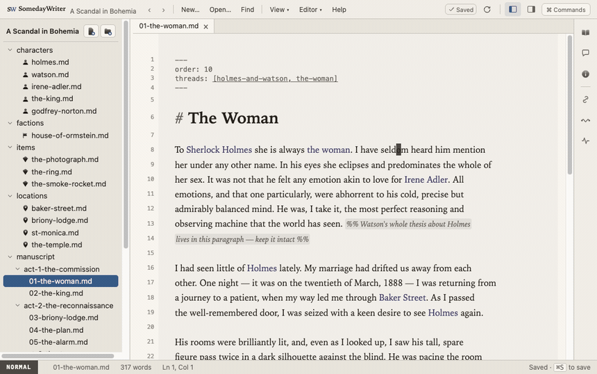
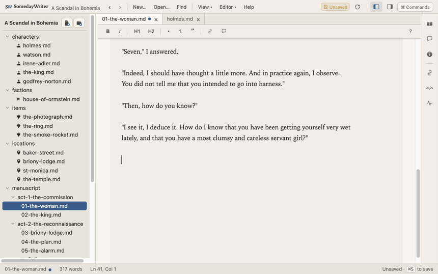
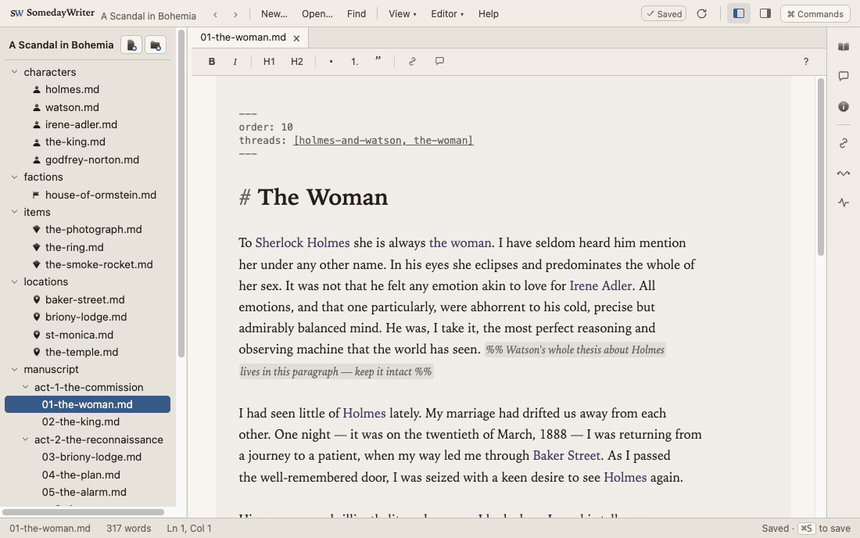
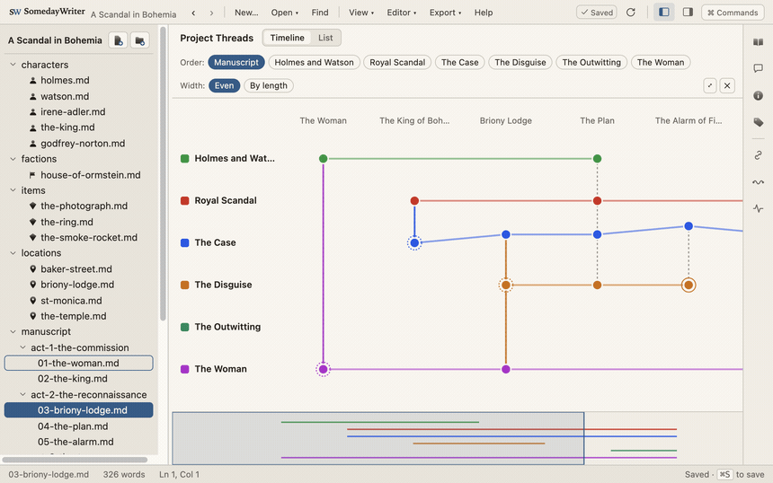
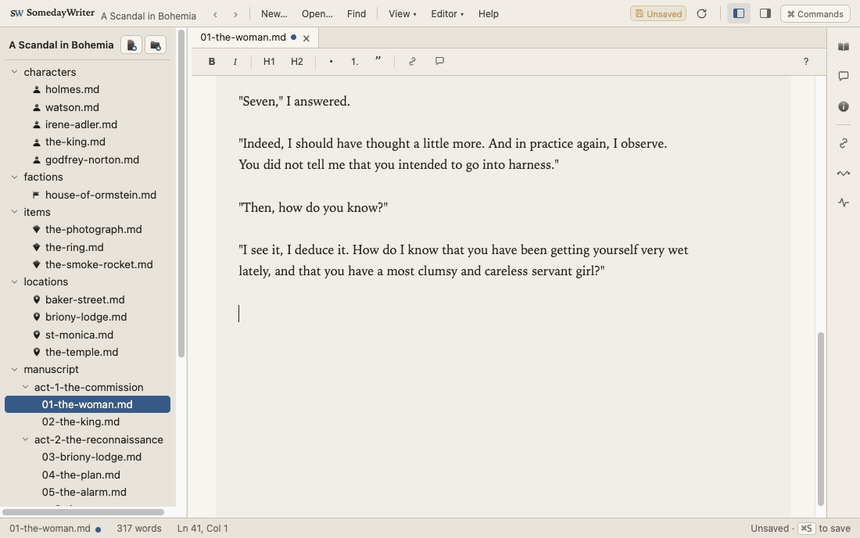
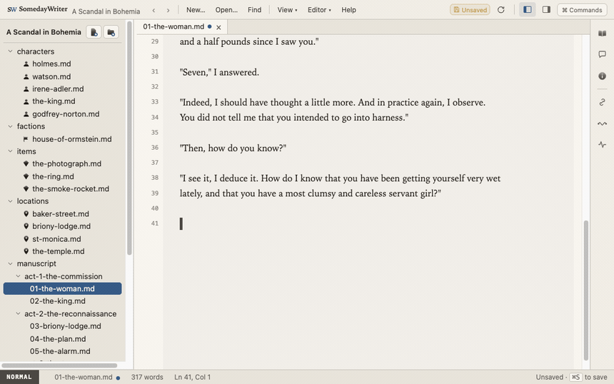

<div align="center">


# SomedayWriter

**A calm, local-first desktop app for writing long-form prose.**

Your novel, script, or docs live as ordinary **Markdown files on disk** — no
proprietary format, no cloud, no lock-in — with a story mind that actually
understands your world and stays quiet until you ask.

[](https://github.com/kevinv92/SomedayWriter/actions/workflows/ci.yml)
&nbsp;·&nbsp; Electron · React · CodeMirror 6 · TypeScript &nbsp;·&nbsp; MIT



</div>

---

## Why SomedayWriter

Most writing apps make you choose: a plain text editor that knows nothing about
your story, or a heavy "novel suite" that traps your work in a database. This is
neither.

- ✍️ **Write in peace.** A serif reading column, warm low-eye-strain themes, a
  focus mode, and real Vim keys. `@{mentions}` and editorial marks soften to
  clean prose at rest and reveal their syntax only when your cursor lands on them.
- 🧠 **A story index that isn't guessing.** Every character, location, thread and
  mention is deterministically indexed from your files — so "find references",
  "go to definition", and a scene **Companion** work on your prose the way they
  work on code.
- 📁 **It's just files.** A folder becomes a project when it has a `project.json`.
  Open it in any editor, keep it in git, sync it however you like. Nothing is
  hidden from you.
- 📖 **Get the draft out.** Compile the manuscript to a single clean Markdown
  file or a proper **EPUB** — editorial notes, comments and tracked changes
  stripped automatically.
- 🤖 **Bring your own AI, or none.** Everything intelligent is opt-in and off by
  default. A built-in MCP server lets **Claude** reason over your real manuscript
  on your own subscription — no API keys or metered cost baked into the app.

<div align="center">

<br/><em>The Companion panel follows whoever's in the current scene — with mention counts and pin-to-freeze.</em>
</div>

---

## See it in action

**Real Vim mode.** Modal editing with a status-bar mode chip and a mode-colored
cursor — and mentions reveal their `@{…}` braces only where your selection lands.

<div align="center">

</div>

**`@`-mention autocomplete from your real cast.** Type `@` and pick from your
actual characters, locations and threads — aliases and all.

<div align="center">

</div>

**Go-to-definition, for prose.** `⌘`-click any mention to jump straight to that
character's page.

<div align="center">

</div>

**Trace your storylines.** The Threads · Timeline lays out one lane per thread;
pick a thread to follow and the lanes refocus around it.

<div align="center">

</div>

**Catch mistakes as you type.** Opt-in spelling/grammar diagnostics squiggle
under the problem — quietly, and only when you turn them on.

<div align="center">

</div>

**Never lose your place.** Live typing in a warm serif column, with the save
state always clear in the menubar.

<div align="center">

</div>

---

## Features

### Writing & editing

- **CodeMirror 6 editor** with Markdown, a reading-optimized measure/typography,
  and a soft reading-column tint.
- **Live syntax softening** — `@{mentions}` show just the name at rest and reveal
  their `@{…}` braces when your cursor enters them; CriticMarkup wrappers
  (`{++insert++}`, `{--delete--}`, `{==highlight==}`) hide their delimiters the
  same way. Prose reads clean; the markup is a keystroke away.
- **Formatting toolbar + shortcuts** — bold/italic/headings/lists/quote/link and
  editorial comment, with `⌘B` / `⌘I` / `⌘K`. Hidden in Vim and focus modes.
- **Real Vim mode** (`@replit/codemirror-vim`) with a status-bar mode chip, a
  mode-colored cursor, and display-line `j`/`k` motion for wrapped prose.
- **Tab to indent**, **Focus mode**, configurable font/size/line-height/measure
  (per project), and a **Markdown & syntax reference** cheat-sheet.
- **Format Table** — tidy a raw GFM table's columns from the palette.
- **Images** — inline preview of `` (via a guarded `writer-asset://`
  protocol), insert from a picker or drag-and-drop, and a read-only viewer for
  image files.

### Files, tabs & navigation

- **File explorer** — new / rename / delete / drag-to-move / drag-to-reorder;
  per-type entity icons; a pinned quick-access section.
- **Tabs** with per-tab unsaved buffers (switching never loses edits) and opt-in
  **autosave**; a clear **Saved / Unsaved / Autosave** button in the menubar.
- **Quick Open** (`⌘P`, fuzzy — matches name _and_ project-relative path) and a
  **command palette** (`⌘⇧P`); both surface recent files / commands first.
- **Find in document** (`⌘F`) and **find across the project** (`⌘⇧F`).
- **Back / forward history** (`⌘[` / `⌘]`) plus `‹ ›` menubar buttons.

### Story intelligence (the `StoryIndex`)

The project is indexed into a deterministic story model — the same index the
editor, the panels, and the [MCP server](#claude-as-your-editor-mcp) all read, so
nothing drifts.

- **Entities** — any profile file with a `type` in its frontmatter: characters,
  locations, items, factions, magic-systems, threads (all extensible per
  project).
- **Mentions** — explicit `@{surface}` references (name or alias), with
  **`@`-completion** from your real profiles. No bare-text auto-linking, so no
  false positives.
- **Find references** and **go-to-definition** (Cmd/Ctrl-click a mention) — "find
  usages / jump to definition," for prose.
- **Panels** — an **Inspector** (what the app parses from a file), a **Companion**
  that auto-follows the current scene's entities (with pin-to-freeze), a
  **References** browser, **Threads**, and a **Project Threads · Timeline** braid
  visualiser (one lane per thread, intersections, branch/merge topology).
- **Project Health** — every `@{surface}` that no longer resolves (a dead
  reference from a rename or typo), click-to-jump.
- **Alias rename refactor** — rename a character in its frontmatter and the app
  offers to rewrite every `@{old}` → `@{new}` across the manuscript.
- **Entity tooling** — a per-project entity-type registry, frontmatter
  intellisense (`type:` / `threads:` / enum fields), and new-file templates.

### Editorial marks (CriticMarkup)

- **Comments** `{>>…<<}` and **highlights** `{==…==}`, with a hover preview and a
  **Comments panel** that lists every note with click-to-jump.
- **Tracked changes** — suggest insertions/deletions/substitutions and
  **accept/reject** the change at the cursor.
- **Inline thread markers** (`<!-- thread:x -->`) scope part of a scene to a
  thread.

### Export & compile

- **Export Manuscript (Markdown)** — concatenates your scenes in manuscript
  `order` into one clean `.md`.
- **Export to EPUB** — a valid EPUB (one chapter per scene, table of contents,
  reading styles) you can open in any e-reader.
- Both **strip your scaffolding on the way out**: frontmatter, `%%` notes,
  `{>>comments<<}`, thread markers — gone; `{==highlights==}` and `@{mentions}`
  unwrapped; tracked changes accepted.

### Look & feel

- A warm, low-eye-strain **design system** — "warm paper" (light) and "warm dusk"
  (dark) themes, six accents, and **custom themes** (project- or user-defined via
  ~20 CSS-var overrides).
- A cohesive **custom SVG icon set** (glossy solids for entities, flat lines for
  chrome).

### AI & grammar

Everything here is **opt-in and off by default**; the core app needs none of it.

- **Grammar & style** behind a pluggable analysis facade (alongside the built-in
  spell check), via **[LanguageTool](https://languagetool.org)** — either its
  **HTTP API** (self-hostable, so prose stays on-device) or a **real language
  server over LSP** (e.g. `ltex-ls`, a live push connection). Configure a
  `grammar` block in `settings.json`; any API key lives in the main process and
  never reaches the UI. Rides the diagnostics toggle like every other provider.

#### Claude as your editor (MCP)

SomedayWriter ships a **[Model Context Protocol](https://modelcontextprotocol.io)
server** so **Claude Desktop / Code** can reason over your _real_ manuscript — on
your subscription, with no API key, no metered cost, and no AI code in the app. It
reuses the exact same `StoryIndex`, exposing every file as a **resource** plus
tools: `project_overview`, `search_project`, `list_entities`, `find_references`,
`definition_of`, `mentions_in`, `thread_beats`, `reading_order`, `read_file`, and
a root-guarded `write_file`.

Point Claude at it (root via `--root` or `WRITER_PROJECT_ROOT`):

```jsonc
{
  "mcpServers": {
    "somedaywriter": {
      "command": "/abs/path/SomedayWriter/node_modules/.bin/tsx",
      "args": [
        "/abs/path/SomedayWriter/src/mcp/server.ts",
        "--root",
        "/abs/path/to/your/project"
      ]
    }
  }
}
```

Then ask grounded questions — _"summarise the Royal Scandal thread"_, _"where is
Irene Adler mentioned?"_ — answered from the real index.

---

## Getting started

Requires **Node 20+**.

```bash
npm install      # install dependencies
npm run dev      # launch the app with hot-reload
```

Open the bundled example to explore everything above:
`examples/scandal-in-bohemia/` — a public-domain Conan Doyle project with
characters, locations, items, a faction, and six interwoven threads.

Build a distributable macOS app (unsigned, local):

```bash
npm run dist:mac   # → dist/SomedayWriter-<version>-arm64.dmg
```

## Scripts

| Command             | What it does                               |
| ------------------- | ------------------------------------------ |
| `npm run dev`       | Launch the app in development (hot-reload) |
| `npm run build`     | Production build to `out/`                 |
| `npm run dist:mac`  | Build a macOS `.dmg` (electron-builder)    |
| `npm run mcp`       | Run the MCP server (`-- --root <project>`) |
| `npm run typecheck` | Type-check main + renderer                 |
| `npm run lint`      | Lint with ESLint                           |
| `npm run format`    | Format with Prettier                       |

Git hooks are set up automatically on `npm install`: **pre-commit** formats and
lints staged files; **pre-push** runs a full type-check + lint. CI runs the same
checks on every push and pull request.

## Project layout

```
src/
  main/       Electron main process — filesystem, IPC, StoryIndex,
              export/EPUB, grammar (LanguageTool HTTP) + LSP client
  preload/    Secure bridge — the only renderer↔main surface (window.api)
  renderer/   React UI (App composes focused hooks under renderer/src/hooks)
  mcp/        Standalone MCP server (reuses the StoryIndex; run via tsx)
  shared/     Types + pure logic shared across the process boundary (@shared)
```

## Tech stack

Electron + Vite + React + TypeScript, bundled with
[electron-vite](https://electron-vite.org). Editor: CodeMirror 6. EPUB via
`marked` + `jszip`. MCP via `@modelcontextprotocol/sdk`.

## Contributing

Standards and conventions live in [AGENTS.md](AGENTS.md); the design rationale and
decision log live in [SPEC.md](SPEC.md) / [DECISIONS.md](DECISIONS.md). Please read
them before making changes.

## License

[MIT](LICENSE)
